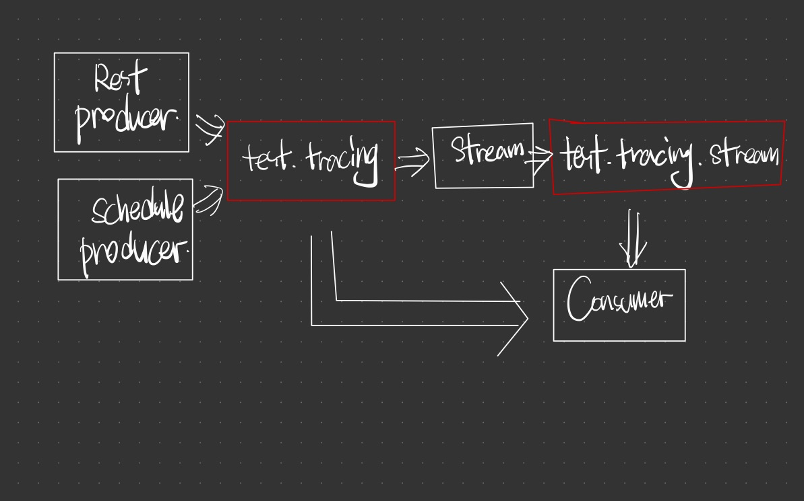

# Getting Started OpenTracing
- https://opentracing.io
- https://opentracing.io/registry
- https://github.com/yurishkuro/opentracing-tutorial
- https://mvnrepository.com/artifact/io.jaegertracing/jaeger-client
- https://mvnrepository.com/artifact/com.google.guava/guava

# Producer App
- https://github.com/opentracing-contrib/java-kafka-client
- https://mvnrepository.com/artifact/io.opentracing.contrib/opentracing-kafka-client
- https://mvnrepository.com/artifact/io.opentracing.contrib/opentracing-kafka-streams
- https://mvnrepository.com/artifact/io.opentracing.contrib/opentracing-kafka-spring

# Requirements
## Kafka
```shell script
git clone git@github.com:confluentinc/cp-all-in-one.git
cd cp-all-in-one/cp-all-in-one
docker-compose up -d

# or

docker run -e ADV_HOST=127.0.0.1 -e EULA="http://dl.lenses.io/d/?id=34c9df40-6180-49b2-b211-e4b02394506b" --rm -p 3030:3030 -p 9092:9092 lensesio/box
```

```
http://localhost:9021
```

## jaeger
```shell script
docker run -d -p6831:6831/udp -p16686:16686 jaegertracing/all-in-one:latest
```

```
http://localhost:16686
```

# Story
- app-simple
  - tracer()
  - traceId, spanId, parentSpanId
  - `asChildOf()`,  `try (Scope ignored = tracer.scopeManager().activate(span))`
  - run jaeger
  - run app
- kafka services
  - 
- app-consumer
  - run kafka
  - `new TracingConsumerFactory<>()`
  - `TracingKafkaConsumer.poll()`
  - `TracingKafkaUtils.buildAndFinishChildSpan`
- app-producer
  - `new TracingProducerFactory<>()`
  - `TracingKafkaProducer.send()`
  - `TracingKafkaUtils.buildAndInjectSpan`
  - `TracingCallback.onCompletion()`
  - open http://localhost:16686
- app-rest-producer
  - `io.opentracing.contrib:opentracing-spring-web-starter:4.1.0`
  - `ServerTracingAutoConfiguration`
  - `new TracingFilter().doFilter()`
  - `new TracingHandlerInterceptor()` skip
  - curl http://localhost:8080/send?message=hello
  - open http://localhost:16686
- app-stream
  - `TracingKafkaClientSupplier`
  - `TransformerWithTracing<V, R> implements Transformer
- etc
  - https://opentracing.io/registry or https://github.com/opentracing-contrib
  - https://github.com/yurishkuro/opentracing-tutorial
- more
  - https://www.jaegertracing.io/docs/1.7/sampling/#client-sampling-configuration
  - https://www.jaegertracing.io/docs/1.19/client-libraries/

## Reference
- https://blog.naver.com/alice_k106/221832024817
- https://jeqo.github.io/posts/2017-09-28-kafka-opentracing/